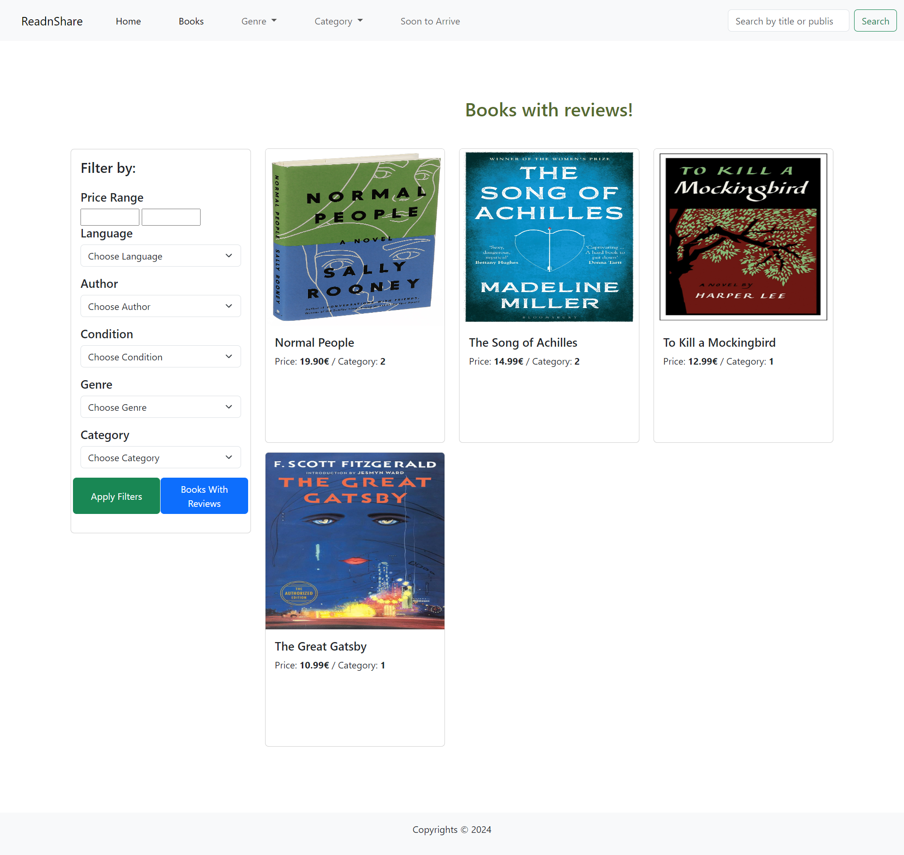
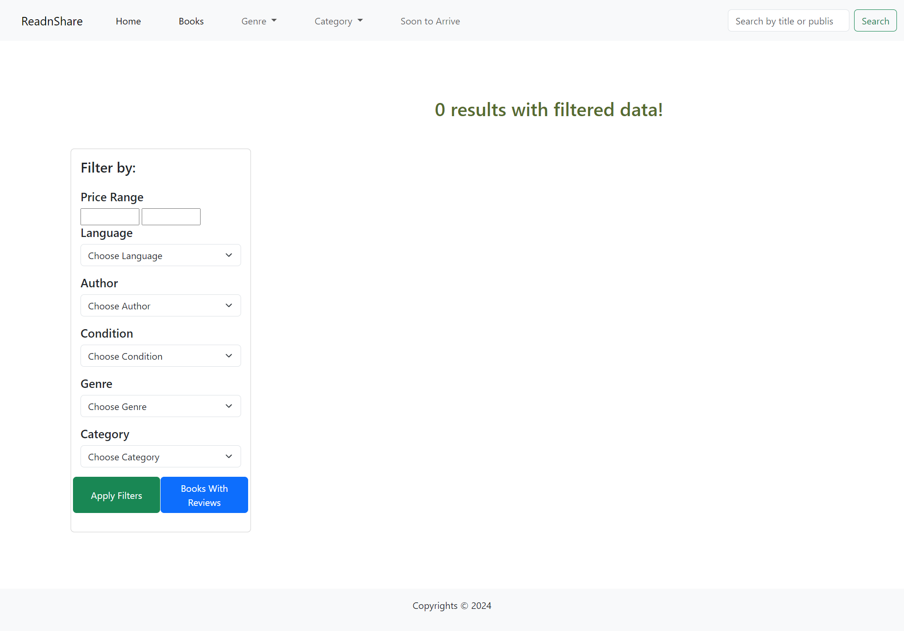
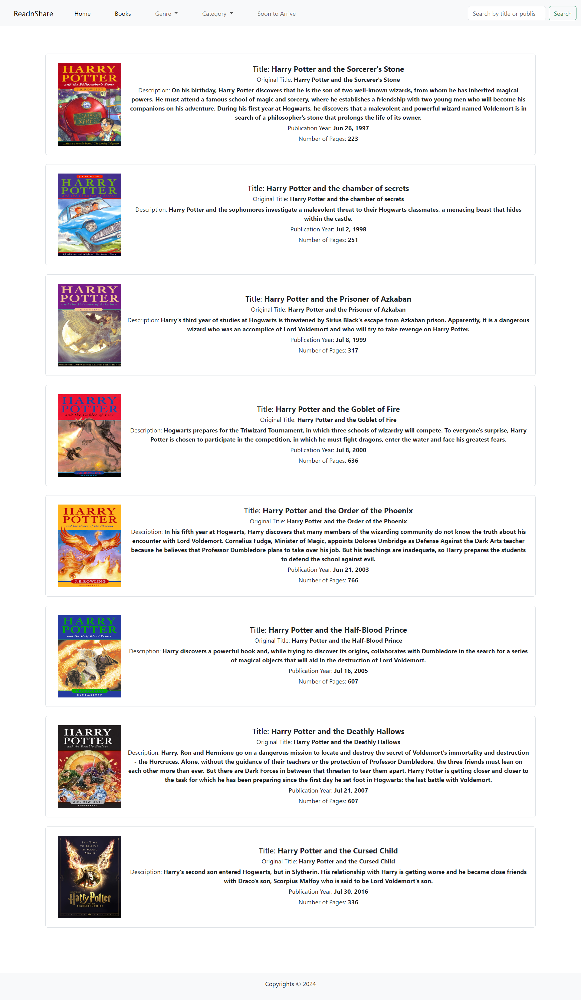
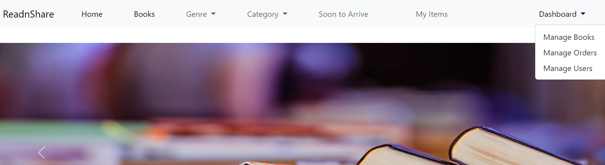
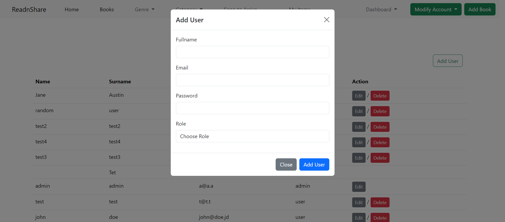

# ReadnShare

## Permbledhje
`ReadnShare` eshte nje aplikacion uebi i zhvilluar me PHP, MySQL dhe Bootstrap ku perdoruesit mund te blejne dhe shesin libra. Platforma i lejon perdoruesit te listojne librat e tyre per shitje, te blejne libra nga perdorues te tjere dhe te menaxhojne llogarite e tyre. Administratoret mund te shikojne dhe menaxhojne perdoruesit, porosite dhe listat e librave. I integruar nje API i jashtem me JavaScript per te shtuar funksionalitet shtese.

## Karakteristikat

- **Index Page**: Ne Index jane te shfaqura librat, te grumbulluara ne dy grupe: librat e fundit dhe best sellers!

 - Ne index ekziston mundesia e te berit subscribe (qe informon perdoruesin nese eshte bere subscribe).

 - Perdoruesi informohet nese eshte bere subscribe me heret me ate email.

 - Librat ne Index mund te klikohen per te pare detajet si dhe mund te shtohen ne Cart edhe nese nuk jemi te kycur ne ndonje llogari dhe llogaria e pare qe kycet, i shtohet asaj llogarie ai liber ne Cart. Mirepo, pa qene i kycur, keto produkte te shtuara ne Cart nuk shihen.

- **Books Page**: Ne Books shfaqen te gjithe librat me informacione kryesore, me mundesi klikimi ne to per te pare me shume detaje rreth librit.

 - Ne Books, librat mund te filtrohen ne baze te nje apo me shume faktoreve njekohesisht (Me poshte kemi shfaqur disa shembuj te filtrimit te librave):
 
 
 - Ne Books, eshte mundesia qe te filtrohen librat per te cilet ka edhe review!
 
 - Ne Books, ne rast se me te dhenat e kerkuara nuk kemi libra, shfaqet mesazhi:
 
 - Librat, pervec filtrimit ne baze te cmimit, gjendjes, autorit, zhanrit, kategorise e te tjera, mund te kerkohen edhe ne baze te titullit apo vitit te publikimit:
 
 - Librat, jane te ndare dhe ne baze te zhanreve, ku me ndihmen e dropdown zgjedhim zhanrin e deshiruar te librit.
 
 - Librat, jane te ndare edhe ne baze te kategorise, ku me ndihmen e dropdown zgjedhim kategorine e deshiruar te librit.
 

 - **Soon to Arrive Page**: Ne Soon to Arrive shfaqen te gjithe librat te cilet do jene se shpejti te qasshem per blerje. Keta libra jane marre nga nje API i jashtem me perdorim te JavaScript. Po ashtu, mund dhe te kerkojme ne baze te titullit apo vitit te publikimit per liber te caktuar se a eshte pjese e ketij API apo jo.
  

- **Autentikimi i Perdoruesit**: Regjistrimi i sigurt (qe dhe informon se jeni regjistruar me sukses) dhe funksionaliteti i kyçjes per perdoruesit.

- **Funksionalitet e Perdoruesit me Rol te Userit**:
  - Modifikoni informacionin e profilit te perdoruesit.
    
  - Ne rast te modifikimit te suksesshem te te dhenave, shfaqet mesazhi
    
  - Fshini llogarine e perdoruesit. (Fshirja e llogarise mund te behet vetem me konfirmim te fjalekalimit si dhe eshte e mundur vetem per perdoruesit me rol te userit)
    
  - Perdoruesi mund t'i shoh produktet ne cart te tij dhe te vazhdoj me tutje me checkout apo edhe ti fshij. Ne rast se nuk ka produkte ne cart, shfaqet nje mesazh.
    
  - Perdoruesi mund t'i shoh orders te tij.
    
  - Perdoruesi mund te porosite libra aq sa jane ne stock. Perdoruesit informohen kur librat jane out of stock .
    
  - Perdoruesi mund te shtoj libra per t'u blere nga perdorues te tjere
    
  - Perdoruesi mund te modifikoj librat e tij apo edhe ti fshij
    
  - Perdoruesi njoftohet ne rast se librat e tij jane shitur
    
  - Perdoruesi mund te shtoj review per libra (kur eshte i kycur)
    

- **Paneli i Adminit**:
  - Paneli i Adminit perfshin menaxhimin e librave, perdoruesve dhe menaxhimin e porosive.
    
  - Admini ka mundesi te shoh apo te fshij porosine
    
  - Admini mund te modifikoj librat apo edhe ti fshij ato (si dhe te shtoj libra te addbook page). 
    
  - Admini mund te shtoj perdorues te ri dhe te caktoj rolin e tyre:user,admin apo autor.
    
  - Admini mund te modifikoj te dhenat e perdoruesit apo edhe te fshij llogarine e perdoruesit
    
  - Admini mund vetem te modifikoj te dhenat e llogarise se tij por jo edhe ta fshij ate.
    

## Teknologjite e Perdorura
- **Frontend**: HTML, CSS, Bootstrap per dizajnin e pershtatshem.
- **Backend**: PHP per pjesen e serverit.
- **Baza e te Dhenave**: MySQL.

## Instalimi
Per te ekzekutuar `readnshare` lokal, ndiqni keto hapa:
1. Klononi repositorin: `git clone https://github.com/hajrijemjeku/readnshare`
2. Shkoni ne drejtorine e projektit: `cd readnshare`
3. Importoni skemen e bazes se te dhenave dhe te dhenat fillestare nga `sql/readnshare.sql` ne bazen tuaj MySQL.
4. Konfiguroni lidhjen me bazen e te dhenave ne `includes/db.php`.
5. Startoni serverin tuaj PHP per zhvillim ose konfiguroni me Apache/Nginx sipas nevojes.

## Perdorimi
1. Startoni serverin PHP.
2. Vizitoni `http://localhost/readnshare` ne shfletuesin tuaj web.
3. Regjistrohuni per nje llogari te re ose kyçuni me kredencialet ekzistuese.
4. Eksploroni dhe perdorni karakteristikat bazuar ne rol te perdoruesit tuaj (perdorues apo admin).

